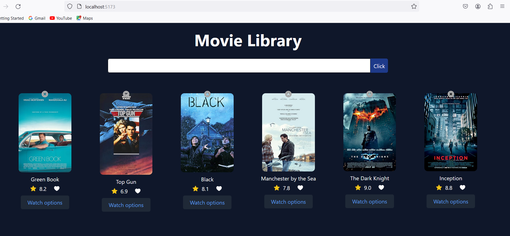
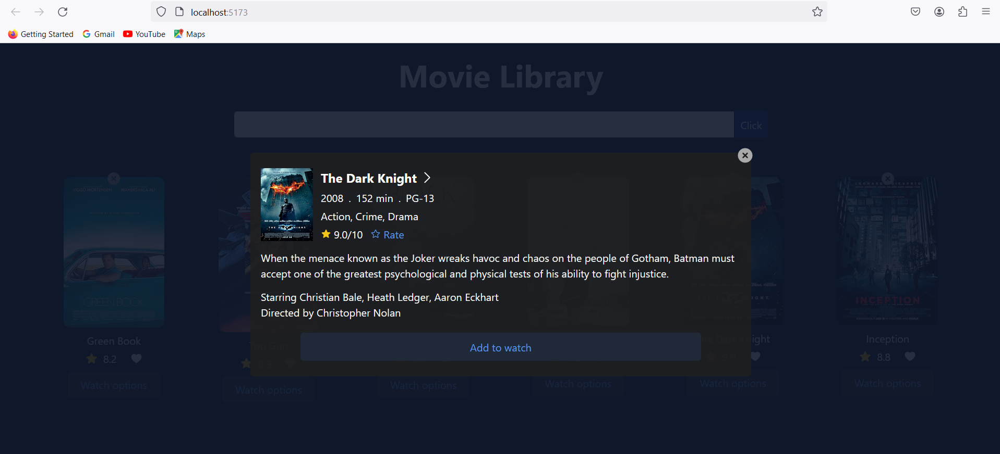

# imdb-app

## Description
This is a simple React application that utilizes the OMDB API to search for and display movie information.
## Getting Started
- Node.js and npm installed on your machine

## Introduction
This application utilizes the OMDB API to provide users with information about various movies. Whether you're looking for details about your favorite films or exploring new ones, this app has got you covered.


## Demo




### Installation:
first extract files and go to project directory
```bash
npm install
```

### To start 
```
npm run build
```


